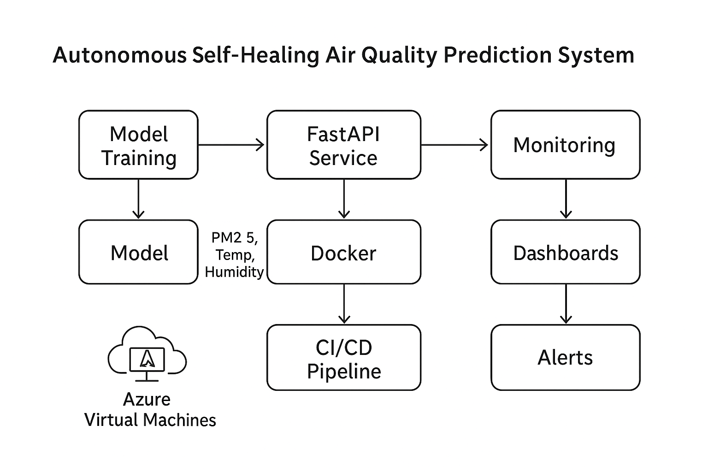

# Self-Healing MLOps: Automated Air Quality Data Pipeline

> **A production-ready data pipeline that automatically collects air quality measurements every 2 hours, validates data quality, and maintains a continuously growing dataset for ML model training.**



---

## 📖 Table of Contents

- [What Does This Do?](#-what-does-this-do)
- [Quick Start](#-quick-start-3-steps)
- [How It Works](#-how-it-works)
- [What I Built](#-what-i-built)
- [Project Structure](#-project-structure)
- [Technical Details](#-technical-details)
- [Next Steps](#-next-steps)

---

## 🎯 What Does This Do?

This project automatically collects real-time air quality data from sensors around the world and prepares it for machine learning. Think of it as a **self-running data collection robot** that:

1. **Fetches fresh air quality data** every 2 hours from OpenAQ API
2. **Stores it in JSON files** (one file per location)
3. **Validates data quality** (catches bad/missing data)
4. **Removes duplicates** automatically
5. **Tracks progress** (knows what data it already has)
6. **Runs forever** without manual intervention

### Real-World Example:

```
12:00 PM → Fetch new air quality data → Add 8 new measurements
2:00 PM  → Fetch new air quality data → Add 12 new measurements
4:00 PM  → Fetch new air quality data → Add 10 new measurements
... continues every 2 hours, 24/7 ...
```

Your dataset keeps growing automatically! 📈

---

## 🚀 Quick Start (3 Steps)

### Step 1: Setup Environment
```bash
# Clone the repository
git clone https://github.com/imarobot00/Self_healing_MLOPS.git
cd Self_healing_MLOPS

# Create environment file
cp dataset/.env.example dataset/.env
```

### Step 2: Start the Pipeline
```bash
# Option A: Using Docker (recommended)
docker compose up -d

# Option B: Run locally
cd dataset
pip install -r requirements.txt
python scheduler.py --mode interval --interval 2
```

### Step 3: Verify It's Working
```bash
# Watch it collect data
docker compose logs -f data-pipeline

# Check your data files (they'll appear soon)
ls -lh dataset/location_*.json
```

**That's it!** The pipeline now runs automatically every 2 hours. 🎉

---

## 🔍 How It Works

### The Logic Behind the Pipeline

```
┌─────────────────────────────────────────────────────────────┐
│                    EVERY 2 HOURS                            │
└─────────────────────────────────────────────────────────────┘
                              ↓
┌─────────────────────────────────────────────────────────────┐
│  1. Load State File (.state.json)                          │
│     "What data do I already have?"                          │
│     Example: Last fetch was 2025-12-05 12:00:00            │
└─────────────────────────────────────────────────────────────┘
                              ↓
┌─────────────────────────────────────────────────────────────┐
│  2. Query OpenAQ API                                        │
│     "Give me measurements AFTER 2025-12-05 12:00:00"        │
│     Fetches: PM2.5, PM10, Temperature, Humidity, etc.       │
└─────────────────────────────────────────────────────────────┘
                              ↓
┌─────────────────────────────────────────────────────────────┐
│  3. Load Existing Data                                      │
│     Opens: location_3459.json (1000 existing records)       │
└─────────────────────────────────────────────────────────────┘
                              ↓
┌─────────────────────────────────────────────────────────────┐
│  4. Remove Duplicates                                       │
│     New: 10 records → Check against existing → Keep 8 new   │
│     (2 were duplicates, removed)                            │
└─────────────────────────────────────────────────────────────┘
                              ↓
┌─────────────────────────────────────────────────────────────┐
│  5. Validate Data Quality                                   │
│     ✓ PM2.5 in range [0-1000]?                             │
│     ✓ Temperature reasonable?                               │
│     ✓ Timestamp format correct?                             │
└─────────────────────────────────────────────────────────────┘
                              ↓
┌─────────────────────────────────────────────────────────────┐
│  6. Append to File                                          │
│     location_3459.json: 1000 + 8 = 1008 records            │
│     File size grows: 25MB → 25.2MB                         │
└─────────────────────────────────────────────────────────────┘
                              ↓
┌─────────────────────────────────────────────────────────────┐
│  7. Update State                                            │
│     .state.json: "Last fetch: 2025-12-05 14:00:00"         │
│     Ready for next run in 2 hours!                          │
└─────────────────────────────────────────────────────────────┘
```

### Why This Design?

**Incremental Loading:** Only fetches new data (efficient, saves API calls)  
**State Tracking:** Remembers progress (no data loss on restart)  
**Deduplication:** Prevents duplicate records (data quality)  
**Validation:** Catches bad data early (reliability)  
**Automation:** Runs forever without human intervention (scalability)

---

## 🛠️ What I Built


### Core Components (Built & Working ✅)

#### 1. **Incremental Data Loader** (`dataset/incremental_loader.py`)
- Fetches air quality measurements from OpenAQ API
- Only downloads NEW data (incremental loading)
- Deduplicates records automatically
- Appends to existing JSON files
- Tracks state in `.state.json`

#### 2. **Scheduler** (`dataset/scheduler.py`)
- Runs the loader every 2 hours automatically
- Uses APScheduler (Python scheduling library)
- Handles errors gracefully (retries on failure)
- Logs all activities
- Supports interval or cron-based scheduling

#### 3. **Data Validator** (`dataset/validator.py`)
- Checks data quality (schema validation)
- Verifies value ranges (e.g., PM2.5: 0-1000 µg/m³)
- Validates timestamps
- Generates quality reports
- Calculates quality scores

#### 4. **Monitoring System** (`dataset/monitor.py`)
- Structured logging (console + file)
- Metrics collection (records fetched, errors, duration)
- Alert manager (Slack, email, webhooks)
- Tracks consecutive failures
- Historical metrics storage

#### 5. **Docker Deployment**
- `Dockerfile` - Container definition
- `docker-compose.yml` - Service orchestration
- Automatic restarts on failure
- Volume mounts for data persistence
- Health checks

#### 6. **GitHub Actions CI/CD** (`.github/workflows/data-pipeline.yml`)
- Runs every 2 hours in GitHub's cloud
- Commits updated data back to repo
- Completely free and serverless
- Alternative to local Docker

---

## 📁 Project Structure

```
Self_healing_MLOPS/
│
├── dataset/                          # 🎯 Main data pipeline
│   ├── incremental_loader.py        # Fetches & updates data
│   ├── scheduler.py                 # Runs every 2 hours
│   ├── validator.py                 # Data quality checks
│   ├── monitor.py                   # Logging & alerts
│   ├── config.yaml                  # Configuration
│   ├── requirements.txt             # Python dependencies
│   ├── .env                         # API keys (you create this)
│   ├── .state.json                  # State tracking (auto-created)
│   ├── location_*.json              # Data files (auto-created)
│   └── PIPELINE_README.md           # Detailed documentation
│
├── Dockerfile                        # Container definition
├── docker-compose.yml                # Service orchestration
├── quickstart.sh                     # Easy start script
│
├── .github/workflows/
│   └── data-pipeline.yml             # GitHub Actions (cloud automation)
│
├── Image/
│   └── archietecture.png             # System architecture diagram
│
├── README.md                         # ← You are here!
├── CHEATSHEET.md                     # Command reference
└── IMPLEMENTATION_SUMMARY.md         # Technical details
```

---

## 🔧 Technical Details

### Technologies Used

| Component | Technology | Purpose |
|-----------|-----------|---------|
| **Language** | Python 3.11+ | Core programming |
| **API** | OpenAQ v3 | Air quality data source |
| **Scheduler** | APScheduler | Automated execution |
| **Container** | Docker | Deployment & isolation |
| **CI/CD** | GitHub Actions | Cloud automation |
| **Config** | YAML | Configuration management |
| **Logging** | Python logging | Activity tracking |
| **Data Format** | JSON | Structured data storage |

### Data Flow Architecture

```
┌─────────────┐
│  OpenAQ API │  (Global air quality sensors)
└──────┬──────┘
       │ HTTPS REST API
       ↓
┌──────────────────┐
│ Incremental      │  Every 2 hours
│ Loader           │  - Fetches new data only
│                  │  - Pagination handling
└────────┬─────────┘
         │
         ↓
┌──────────────────┐
│  Deduplicator    │  Removes duplicates
│                  │  (composite key matching)
└────────┬─────────┘
         │
         ↓
┌──────────────────┐
│   Validator      │  Quality checks
│                  │  - Schema validation
│                  │  - Range validation
└────────┬─────────┘
         │
         ↓
┌──────────────────┐
│  JSON Storage    │  location_*.json files
│  + State         │  .state.json
└──────────────────┘
```

### How Incremental Loading Works

**Traditional Approach (Inefficient):**
```
Every run → Download ALL data → 1M records → 50MB → Slow
```

**Our Approach (Smart):**
```
First run  → Download all      → 1,000 records → Save state: "2025-12-05 12:00"
Second run → Download since 12:00 → 8 new records → Append
Third run  → Download since 14:00 → 12 new records → Append
```

**Result:** 100x faster, less API usage, no duplicates!

### Deduplication Algorithm

```python
# Each record gets a unique key
key = f"{location_id}_{parameter_id}_{sensor_id}_{timestamp_from}_{timestamp_to}"

# Example:
# "3459_pm25_12345_2025-12-05T12:00:00Z_2025-12-05T13:00:00Z"

# Before adding: check if key exists → Skip if yes → Add if no
```

---

## 🎓 What You Can Do With This

### Current Capabilities (Phase 1 - Complete ✅)

- ✅ **Collect data automatically** every 2 hours
- ✅ **9 locations monitored** (configurable in `config.yaml`)
- ✅ **Data validation** and quality checks
- ✅ **Historical data** preserved and growing
- ✅ **Run locally or in cloud** (Docker/GitHub Actions)
- ✅ **Monitoring and alerts** for failures

### Next Steps (Phase 2 - Future Work)

- [ ] **ML Model Training**: Train LSTM/Regression on collected data
- [ ] **Feature Engineering**: Create rolling averages, time features
- [ ] **Drift Detection**: Implement KS-test, PSI for data drift
- [ ] **FastAPI Service**: Real-time predictions endpoint
- [ ] **Grafana Dashboard**: Visualize data and metrics
- [ ] **Azure VM Deployment**: Production hosting
- [ ] **Self-Healing Logic**: Auto-retrain on drift detection

---

## 📊 Sample Data Structure

### What the Data Looks Like

**location_3459.json:**
```json
[
  {
    "value": 25.3,
    "parameter": {
      "id": 19,
      "name": "pm25",
      "units": "µg/m³"
    },
    "period": {
      "interval": "01:00:00",
      "datetimeFrom": {
        "utc": "2025-12-05T12:00:00Z"
      },
      "datetimeTo": {
        "utc": "2025-12-05T13:00:00Z"
      }
    },
    "locationId": 3459,
    "sensors": [
      {
        "id": 12345,
        "name": "AirQuality Sensor #1"
      }
    ]
  },
  ... thousands more records ...
]
```

**State File (.state.json):**
```json
{
  "locations": {
    "3459": {
      "last_fetch_time": "2025-12-05T14:00:00Z",
      "last_records_count": 8,
      "last_successful_run": "2025-12-05T14:05:23Z"
    }
  }
}
```

---

## 🎮 Common Commands

```bash
# Start the pipeline
docker compose up -d

# Watch logs (see it work in real-time)
docker compose logs -f data-pipeline

# Stop the pipeline
docker compose down

# Check data files
ls -lh dataset/location_*.json

# View state
cat dataset/.state.json | python -m json.tool

# Run once (testing)
cd dataset && python incremental_loader.py --locations 3459

# Test components
cd dataset && python test_pipeline.py
```

---

## 🐛 Troubleshooting

### Pipeline Not Running?
```bash
# Check container status
docker compose ps

# View logs for errors
docker compose logs data-pipeline
```

### No Data Being Collected?
```bash
# Check API connectivity
curl "https://api.openaq.org/v3/locations/3459"

# Verify .env file exists
cat dataset/.env
```

### Docker Issues?
```bash
# Restart Docker service
sudo systemctl restart docker

# Rebuild container
docker compose up -d --build
```

---

## 🚀 Deployment Options

### Option 1: Local Docker (Current Setup)
- **Runs on:** Your computer
- **Cost:** Free
- **Pros:** Full control, instant access
- **Cons:** Only runs when computer is on

### Option 2: GitHub Actions (Cloud, Free)
- **Runs on:** GitHub's servers
- **Cost:** Free (public repos)
- **Pros:** 24/7, no local resources
- **Cons:** 6hr/month limit, data in repo

### Option 3: Azure VM (Production)

```
self-healing-air-quality/
│
├── dataset/              # 🆕 Automated data pipeline (implemented)
│   ├── incremental_loader.py   # Fetch & update data every 2 hours
│   ├── scheduler.py             # APScheduler for automation
│   ├── validator.py             # Data quality validation
│   ├── monitor.py               # Logging & metrics
│   ├── config.yaml              # Pipeline configuration
│   ├── location_*.json          # Air quality data files
│   └── PIPELINE_README.md       # 📖 Full pipeline documentation
│
├── data/                 # Raw + processed datasets (future)
├── models/               # Saved model artifacts (future)
├── src/                  # ML pipeline (to be implemented)
│   ├── training/         # Training & retraining scripts
│   ├── inference/        # FastAPI app
│   ├── monitoring/       # Drift detection, alerts
│   └── utils/            # Shared utilities
│
├── docker/               # 🆕 Containerization (implemented)
│   ├── Dockerfile
│   └── docker-compose.yml
│
├── .github/              # 🆕 CI/CD workflows (implemented)
│   └── workflows/
│       └── data-pipeline.yml   # Scheduled data loading
│
├── Image/
│   └── archietecture.png  # System architecture diagram
│
└── README.md
```

---

## 🚀 Quick Start - Data Pipeline

The automated data pipeline is now fully operational! It fetches OpenAQ air quality data every 2 hours.

### Option 1: Docker (Recommended)
```bash
# Setup
cp dataset/.env.example dataset/.env
# Add your OPENAQ_API_KEY to .env (optional)

# Run
docker-compose up -d

- **Runs on:** Azure cloud servers
- **Cost:** ~$10-20/month
- **Pros:** 24/7, production-grade, scalable
- **Cons:** Requires setup, monthly cost

---

## 📚 Additional Documentation

- **[PIPELINE_README.md](dataset/PIPELINE_README.md)** - Complete pipeline documentation
- **[CHEATSHEET.md](CHEATSHEET.md)** - Quick command reference
- **[IMPLEMENTATION_SUMMARY.md](IMPLEMENTATION_SUMMARY.md)** - Technical deep dive

---

## 💡 Key Learnings & Design Decisions

### Why Incremental Loading?
Fetching only new data is 100x faster than downloading everything each time. Saves API quota and bandwidth.

### Why JSON Files?
- Simple, human-readable
- No database setup needed
- Easy to version control
- Perfect for development
- Later: migrate to PostgreSQL/TimescaleDB for production

### Why State Tracking?
Without state, we'd have to scan all existing data to find what's new. State file makes it instant.

### Why Docker?
- Same environment everywhere
- Easy deployment
- Isolation from system
- One command to start/stop

### Why Every 2 Hours?
Balance between freshness and API limits. Too frequent = wasted calls. Too long = stale data.

---

## 🎯 Success Metrics

After running for 1 week, you should have:
- ✅ ~84 automatic data fetches (24/7 × 7 days ÷ 2 hours)
- ✅ ~1000+ new measurements per location
- ✅ Validated, deduplicated, clean dataset
- ✅ Ready for ML model training

---

## 🤝 Contributing

This is a personal project, but feel free to:
- Open issues for bugs
- Suggest improvements
- Fork and extend for your use case

---

## 📝 License

MIT License - feel free to use for learning and personal projects.

---

## 👤 Author

**Bipul Dahal**  
Final-year Engineering Student  
Building production-grade MLOps systems

📧 Contact: [GitHub - @imarobot00](https://github.com/imarobot00)

---

## 🙏 Acknowledgments

- **OpenAQ** - For providing free air quality data API
- **APScheduler** - Python scheduling library
- **Docker** - Containerization platform
- **GitHub Actions** - Free CI/CD automation

---

## ⭐ Quick Reference

| Task | Command |
|------|---------|
| Start pipeline | `docker compose up -d` |
| View logs | `docker compose logs -f data-pipeline` |
| Stop pipeline | `docker compose down` |
| Check data | `ls -lh dataset/location_*.json` |
| Test components | `cd dataset && python test_pipeline.py` |
| Run once | `./quickstart.sh once` |

---

**Built with ❤️ for the MLOps community**
