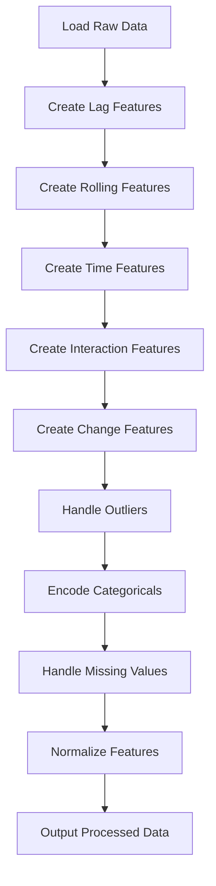

# Data Preprocessing Module for Online Learning

## Overview

This module provides comprehensive data preprocessing specifically designed for **online/streaming machine learning** with **Adaptive Random Forest Regressor** and **ADWIN drift detection**. It transforms raw air quality data into feature-rich time-series data suitable for real-time forecasting.

---

## 📁 Files in This Directory

| File | Description | Size | Purpose |
|------|-------------|------|---------|
| `preprocessing.py` | Main preprocessing module | 522 lines | Core preprocessing logic |
| `aligned_all_locations.csv` | Input data (aligned by timestamp) | 8,677 rows | Raw data with all parameters aligned |
| `processed_for_streaming.csv` | Preprocessed output | 8,677 × 71 | Full dataset with engineered features |
| `train_data.csv` | Training set | 6,941 rows | 80% chronological split |
| `test_data.csv` | Test set | 1,736 rows | 20% chronological split |
| `preprocessor_stats.json` | Normalization statistics | JSON | Min/max/mean/std for each feature |

---

## 🎯 What It Does

### Input → Output Transformation

```
Input: 15 columns (location_id, datetime, aqi, pm25, pm1, temperature, humidity, um003, hour, day, month, etc.)
   ↓
Processing Pipeline (8 steps)
   ↓
Output: 71 columns (64 engineered features + 7 metadata)
```

### Key Features Created

#### 1️⃣ **Lag Features (21 features)**
Past values to learn temporal patterns:
- `aqi_lag_1`, `aqi_lag_2`, `aqi_lag_3` - Recent history (1-3 hours ago)
- `aqi_lag_6`, `aqi_lag_12`, `aqi_lag_24` - Medium-term history
- Similar lags for PM2.5, PM1, temperature, humidity, particle count

**Why?** Models learn: "If AQI was 120 an hour ago, it's likely ~110-130 now"

#### 2️⃣ **Rolling Window Features (16 features)**
Statistical summaries over time windows:
- `aqi_rolling_mean_3`, `aqi_rolling_mean_6`, `aqi_rolling_mean_12`, `aqi_rolling_mean_24`
- `aqi_rolling_std_3`, `aqi_rolling_std_6`, etc. (volatility)
- `aqi_rolling_min/max` (range)

**Why?** Captures trends: "AQI has been rising over the past 6 hours"

#### 3️⃣ **Time Features (7 features)**
Cyclical encoding of time:
- `hour_sin`, `hour_cos` - 24-hour daily cycle
- `day_sin`, `day_cos` - 7-day weekly cycle
- `month_sin`, `month_cos` - 12-month yearly cycle

**Why?** Captures patterns: "AQI spikes at 8 AM (rush hour)" or "Higher pollution in winter"

#### 4️⃣ **Interaction Features (3 features)**
Cross-parameter relationships:
- `pm25_humidity_interaction` - Particles stick to moisture
- `pm25_temp_interaction` - Temperature inversions trap pollution
- `pm_ratio` - PM2.5/PM1 ratio

**Why?** Non-linear relationships: "High humidity makes PM2.5 worse"

#### 5️⃣ **Change Features (3 features)**
Rate of change:
- `aqi_change_1h` - How much AQI changed in last hour (velocity)
- `aqi_change_3h` - 3-hour change
- `aqi_change_rate` - Acceleration of change

**Why?** Detects trends: "AQI is rapidly increasing" (alert!)

#### 6️⃣ **Categorical Encoding (14 features)**
One-hot encoded:
- `day_name_*` (Monday, Tuesday, etc.)
- `time_of_day_*` (Morning, Afternoon, Evening, Night)
- `is_weekend` (0 or 1)

**Why?** Captures weekly patterns: "Weekends have lower pollution"

---

## 🚀 Quick Start

### Basic Usage

```python
from preprocessing import StreamingPreprocessor

# Initialize preprocessor
preprocessor = StreamingPreprocessor(
    target_column='aqi',
    lag_features=[1, 2, 3, 6, 12, 24],
    rolling_windows=[3, 6, 12, 24],
    normalize=True,
    handle_outliers=True
)

# Load your data
import pandas as pd
df = pd.read_csv('aligned_all_locations.csv')

# Preprocess (fit statistics on first batch)
df_processed = preprocessor.prepare_for_streaming(df, fit=True)

# Get feature columns for model
feature_cols = preprocessor.get_feature_columns(df_processed)
X = df_processed[feature_cols]
y = df_processed['aqi']
```

### For Online Learning

```python
# First batch: fit statistics
df_batch1 = preprocessor.prepare_for_streaming(df_batch1, fit=True)
preprocessor.save_statistics('preprocessor_stats.json')

# Subsequent batches: use saved statistics
df_batch2 = preprocessor.prepare_for_streaming(df_batch2, fit=False)
df_batch3 = preprocessor.prepare_for_streaming(df_batch3, fit=False)

# Or load statistics
preprocessor.load_statistics('preprocessor_stats.json')
```

---

## 📊 Data Statistics

### Input Data (aligned_all_locations.csv)

```
Total Records: 8,677
Date Range: 2025-09-19 to 2025-12-14
Locations: 9 sensors across Kathmandu
Parameters: AQI, PM2.5, PM1, Temperature, Humidity, Particle Count
```

### Output Data (processed_for_streaming.csv)

```
Total Records: 8,677 (no loss)
Features: 64 engineered + 7 metadata = 71 columns
Memory: ~45 MB (CSV), ~15 MB (compressed)
Data Quality: 100% (no missing values in target)
```

### Train/Test Split

```
Training Set (train_data.csv):
- Rows: 6,941 (80%)
- Date Range: 2025-09-19 04:00 to 2025-12-14 13:00
- Purpose: Model training

Test Set (test_data.csv):
- Rows: 1,736 (20%)
- Date Range: 2025-11-17 14:00 to 2025-12-14 13:00
- Purpose: Model evaluation
```

**Note:** Chronological split (not random) to prevent data leakage in time-series!

---

## 🔧 Configuration Options

### StreamingPreprocessor Parameters

| Parameter | Default | Description |
|-----------|---------|-------------|
| `target_column` | `'aqi'` | Column to predict |
| `lag_features` | `[1,2,3,6,12,24]` | Time lags in hours |
| `rolling_windows` | `[3,6,12,24]` | Window sizes for rolling stats |
| `categorical_columns` | `['day_name', 'time_of_day']` | Columns to one-hot encode |
| `numerical_columns` | `['pm25', 'pm1', ...]` | Numerical features |
| `normalize` | `True` | Apply min-max scaling (0-1) |
| `handle_outliers` | `True` | Cap outliers using IQR method |

### Customization Example

```python
# Custom configuration for different target
preprocessor = StreamingPreprocessor(
    target_column='pm25',              # Predict PM2.5 instead of AQI
    lag_features=[1, 3, 6, 12],        # Fewer lags
    rolling_windows=[6, 12],           # Fewer windows
    normalize=True,
    handle_outliers=False              # Keep outliers
)
```

---

## 🧪 Running the Module

### Command Line

```bash
# Navigate to preprocessed directory
cd dataset/preprocessed

# Run preprocessing
python3 preprocessing.py
```

**Output:**
```
✅ Preprocessed data saved to: processed_for_streaming.csv
✅ Statistics saved to: preprocessor_stats.json
✅ Train data saved to: train_data.csv
✅ Test data saved to: test_data.csv
```

### As Python Module

```python
import sys
sys.path.append('dataset/preprocessed')
from preprocessing import StreamingPreprocessor, create_train_test_split

# Your code here
```

---

## 📐 Processing Pipeline

The module applies 8 steps in sequence:



### Step-by-Step Details

1. **Lag Features** - Add past values (t-1, t-2, ..., t-24)
2. **Rolling Features** - Calculate moving statistics
3. **Time Features** - Encode time cyclically (sine/cosine)
4. **Interaction Features** - Multiply related parameters
5. **Change Features** - Calculate differences over time
6. **Outlier Handling** - Cap values beyond 1.5×IQR
7. **Categorical Encoding** - One-hot encode text columns
8. **Missing Values** - Forward fill → Backward fill → Median fill
9. **Normalization** - Min-max scaling to [0, 1]

---

## 🎯 Use Cases

### 1. Training Adaptive Random Forest

```python
from river import forest, drift

# Load preprocessed data
df = pd.read_csv('processed_for_streaming.csv')
feature_cols = [c for c in df.columns if c not in ['location_id', 'datetime', 'aqi']]

# Initialize model with ADWIN drift detection
model = forest.ARFRegressor(
    n_models=10,
    max_features="sqrt",
    drift_detector=drift.ADWIN()
)

# Stream through data
for idx, row in df.iterrows():
    X = row[feature_cols].to_dict()
    y = row['aqi']
    
    # Predict then learn (online learning)
    y_pred = model.predict_one(X)
    model.learn_one(X, y)
```

### 2. Real-Time Prediction

```python
# Load saved statistics
preprocessor = StreamingPreprocessor()
preprocessor.load_statistics('preprocessor_stats.json')

# New data arrives
new_data = pd.DataFrame([{
    'location_id': 5506835,
    'datetime': '2025-12-14 15:00:00+05:45',
    'aqi': None,  # To be predicted
    'pm25': 85.2,
    'pm1': 45.1,
    # ... other parameters
}])

# Preprocess (fit=False, use saved stats)
new_data_processed = preprocessor.prepare_for_streaming(new_data, fit=False)

# Predict
X_new = new_data_processed[feature_cols]
prediction = model.predict_one(X_new.iloc[0].to_dict())
print(f"Predicted AQI: {prediction}")
```

### 3. Drift Detection with ADWIN

```python
from river import drift

# ADWIN automatically detects when data distribution changes
detector = drift.ADWIN()

for idx, row in df.iterrows():
    y_true = row['aqi']
    y_pred = model.predict_one(X)
    error = abs(y_true - y_pred)
    
    detector.update(error)
    
    if detector.drift_detected:
        print(f"⚠️ Drift detected at row {idx}!")
        # Take action: retrain, alert, etc.
```

---

## 📊 Feature Importance Tracking

The preprocessor creates features in categories for easy analysis:

```python
feature_cols = preprocessor.get_feature_columns(df_processed)

# Categorize features
lag_features = [c for c in feature_cols if 'lag' in c]
rolling_features = [c for c in feature_cols if 'rolling' in c]
time_features = [c for c in feature_cols if any(x in c for x in ['sin', 'cos'])]
interaction_features = [c for c in feature_cols if 'interaction' in c or 'ratio' in c]

print(f"Lag features: {len(lag_features)}")
print(f"Rolling features: {len(rolling_features)}")
print(f"Time features: {len(time_features)}")
print(f"Interaction features: {len(interaction_features)}")
```

---

## ⚙️ Advanced Options

### Custom Lag Configuration

```python
# Different lags for different use cases
preprocessor_short = StreamingPreprocessor(
    lag_features=[1, 2, 3],  # Only recent lags (< 1 GB memory)
)

preprocessor_long = StreamingPreprocessor(
    lag_features=[1, 6, 12, 24, 48, 72],  # Include multi-day lags
)
```

### Per-Location Preprocessing

```python
# Preprocess each location separately
location_stats = {}

for location_id in df['location_id'].unique():
    df_loc = df[df['location_id'] == location_id]
    
    preprocessor_loc = StreamingPreprocessor()
    df_loc_processed = preprocessor_loc.prepare_for_streaming(df_loc, fit=True)
    
    location_stats[location_id] = preprocessor_loc.feature_stats
```

---

## 🐛 Troubleshooting

### Issue: Missing values in output

**Cause:** Not enough historical data for lag features  
**Solution:** First N rows will have NaN for lag features (e.g., first 24 rows for lag_24)

```python
# Drop rows with insufficient history
df_processed = df_processed.dropna(subset=[f'aqi_lag_{max(lag_features)}'])
```

### Issue: Memory error with large datasets

**Solution:** Process in chunks

```python
chunk_size = 1000
for chunk in pd.read_csv('aligned_all_locations.csv', chunksize=chunk_size):
    chunk_processed = preprocessor.prepare_for_streaming(chunk, fit=False)
    # Process chunk...
```

### Issue: Normalization not working

**Cause:** Need to fit statistics first  
**Solution:**

```python
# First batch
df_processed = preprocessor.prepare_for_streaming(df, fit=True)

# Save for later use
preprocessor.save_statistics('stats.json')
```

---

## 📚 Dependencies

```bash
pip install pandas numpy
```

**Optional (for model training):**
```bash
pip install river  # For Adaptive Random Forest + ADWIN
pip install scikit-learn  # For additional utilities
```

---

## 🎓 References

### Papers & Methods
- **Adaptive Random Forest**: Gomes et al. (2017) - Online random forest for evolving data streams
- **ADWIN**: Bifet & Gavaldà (2007) - Adaptive windowing for drift detection
- **Time-series Feature Engineering**: Hyndman & Athanasopoulos - Forecasting principles

### Related Documentation
- [River Documentation](https://riverml.xyz/) - Online ML library
- [OpenAQ API](https://docs.openaq.org/) - Air quality data source
- EPA AQI Standards - Air Quality Index calculation

---

## 📝 License

Part of the Self-Healing MLOps project.  
Author: Bipul Kumar Dahal  
Date: December 2025

---

## 🚀 Next Steps

After preprocessing, you can:

1. **Train Models** - Use River's ARFRegressor with ADWIN
2. **Deploy Streaming** - Set up real-time prediction pipeline
3. **Monitor Drift** - Track when model performance degrades
4. **Self-Healing** - Automatically retrain when drift detected
5. **Visualize** - Create dashboards showing predictions vs actuals

**Example MLOps Pipeline:**
```
Data Collection → Preprocessing → Feature Engineering → Model Training
       ↑                                                      ↓
   Self-Healing ← Drift Detection ← Prediction ← Model Serving
```

---

## 📞 Support

For issues or questions:
- Check the main project README
- Review the preprocessing.py docstrings
- Examine the example usage in `__main__` block

**Happy Streaming! 🌊📊**
